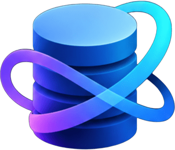
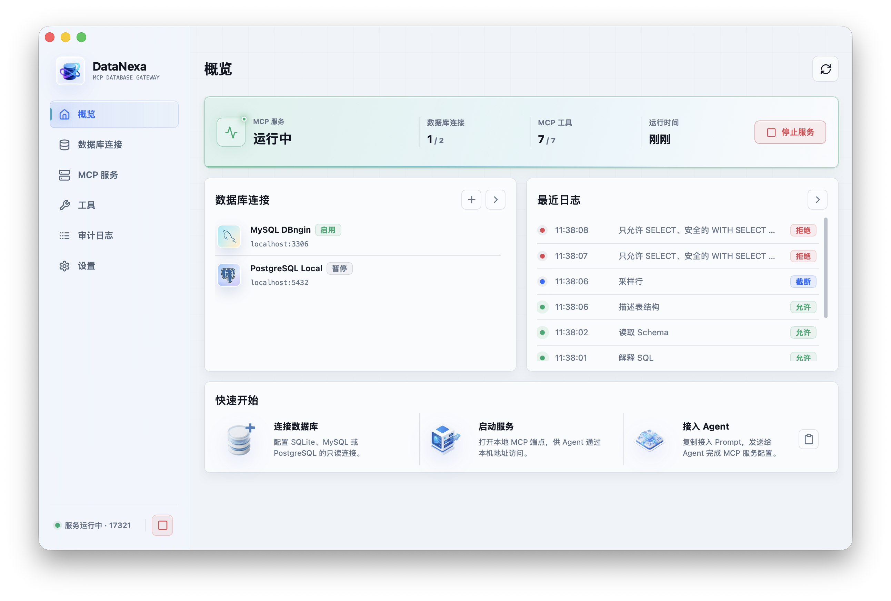

<p align="center">
  
</p>

<h1 align="center">DataNexa</h1>

<p align="center">
  简体中文 | <a href="docs/README.en.md">English</a>
</p>

<p align="center">
  面向 AI Agent 的本地只读数据库 MCP 网关
</p>

<p align="center">
  <a href="https://github.com/MingoZacwu/DataNexa/actions/workflows/compile.yml"></a>
  <a href="https://github.com/MingoZacwu/DataNexa/releases"></a>
  <a href="LICENSE"></a>
</p>

DataNexa 是一个运行在本机的数据库 MCP 服务。它为 AI Agent 提供统一、受控且可审计的数据访问入口，在执行查询前应用只读策略，并对返回行数、执行时间和连接数量进行限制。

DataNexa 原生支持 SQLite、MySQL 和 PostgreSQL，并通过 JDBC 支持(技术预览)连接更多数据库。桌面端基于 Tauri、React 与 Rust 构建。

## 为什么做 DataNexa

让 AI 连上数据库并不难，难的是让这件事可控、可信。DataNexa 的初衷，归结起来是三件事：

**一份 MCP 配置，访问多个数据库。** 数据库一多，为每个库逐一配置 MCP 服务既繁琐又难以维护。DataNexa 把所有连接聚合到同一个本地 MCP 服务：Agent 侧只需维护一份 MCP 配置，即可按需访问多个已启用的数据库。

**拿不到只读账号时，前置一道防线。** 理想情况下，AI 应当使用数据库只读账号访问数据；但现实中，我们未必能为每套企业数据申请到只读账号。DataNexa 在 Agent 与数据库之间充当前置网关：基于 SQL 语法树校验，非只读语句一律拦截，同时限制返回行数、执行时间与连接数量——在无法变更账号权限时，尽可能收窄风险面。

**AI 对数据库做了什么，一目了然。** 把数据库交给 AI，最大的不安是不知道它实际执行了什么。DataNexa 在本地保留完整审计记录：哪条 SQL、何时执行、调用了哪个工具、结果如何，每一次数据访问都清清楚楚、有据可查。

## 功能特性

- 统一管理 SQLite、MySQL 和 PostgreSQL 只读连接
- 通过 JDBC 支持(技术预览)连接其他数据库：从 Maven 安装 JDBC 驱动并使用 JDBC URL 建立连接，同样受只读策略与审计约束
- 提供表结构发现、字段描述、数据采样、只读 SQL 和查询计划等 MCP 工具
- 基于 SQL 语法树校验查询，限制为只读语句
- 支持 Bearer Token 鉴权、手动轮换与访问令牌自动熔断
- 数据库密码保存到操作系统凭证库，不写入常规配置文件
- 支持最大返回行数、查询超时和连接池上限
- 保留本地审计记录，支持按保存天数自动清理，并可对 SQL 字面量进行脱敏
- 提供连接诊断、工具开关、紧急禁用和连接导入/导出
- 支持简体中文、英文以及浅色/深色主题

## 界面预览



## 下载与安装

预编译版本可从 [Releases](https://github.com/MingoZacwu/DataNexa/releases) 页面下载。请根据操作系统选择对应的安装包或可执行文件，并优先使用最新稳定版本。

首次运行后，按以下顺序完成配置：

1. 新建数据库连接，并使用数据库侧的只读账号。
2. 测试连接，确认网络、凭证和权限配置正确。
3. 在“MCP 服务”页面启动本地服务。
4. 复制 Agent 接入配置，并添加到支持 MCP 的客户端。

## 从源码构建

### 环境要求

- [Git](https://git-scm.com/)
- [Node.js 20](https://nodejs.org/) 或更高版本
- [pnpm 9](https://pnpm.io/)
- [Rust stable](https://www.rust-lang.org/tools/install)
- [Java SE 21 (JDK)](https://adoptium.net/) 和 [Maven 3.9](https://maven.apache.org/)，用于构建 JDBC sidecar
- Tauri 2 所需的系统依赖

各平台的系统依赖不同，完整说明见 [Tauri Prerequisites](https://v2.tauri.app/start/prerequisites/)：

- Windows：Microsoft C++ Build Tools、WebView2，以及 Rust MSVC 工具链
- macOS：Xcode Command Line Tools
- Ubuntu/Debian：`libwebkit2gtk-4.1-dev`、`libayatana-appindicator3-dev`、`librsvg2-dev`、`patchelf`、`xdg-utils`

### 获取源码

```bash
git clone https://github.com/MingoZacwu/DataNexa.git
cd DataNexa
corepack enable
corepack prepare pnpm@9 --activate
pnpm install --frozen-lockfile
```

### 本地开发

```bash
pnpm run build:jdbc-sidecar
pnpm run dev:app
```

第一条命令构建 JDBC sidecar JAR(首次运行或 sidecar 代码变更后需要执行)。第二条命令会启动 Vite 开发服务，并以 Tauri 桌面窗口运行应用。

如需在本地开发中使用 JDBC 功能，还需要一个 Java 运行时：可以在应用的设置页下载 DataNexa 托管运行时，或选择本机已安装的外部 Java 运行时。

### 编译可执行文件

```bash
pnpm run build:portable
```

该命令会先自动构建 JDBC sidecar(需要 JDK 和 Maven)，再编译应用。编译结果位于 `src-tauri/target/release/`。Windows 下通常为 `datanexa.exe`，macOS 和 Linux 下为对应平台的 `datanexa` 可执行文件。

### 构建安装包

```bash
pnpm run build:installer
```

该命令同样会先自动构建 JDBC sidecar。安装包及平台相关产物位于：

```text
src-tauri/target/release/bundle/
```

安装包不内置 Java 运行时。JDBC 功能首次使用时，可在应用设置中下载 DataNexa 托管运行时，或选择本机已有的外部 Java 运行时。

仅需检查前端类型和构建结果时，可运行：

```bash
pnpm run build
```

> DataNexa 只能为当前构建平台生成原生应用。若需要 Windows、macOS 和 Linux 版本，请分别在对应系统上构建。

## 安全说明

“只读”是降低风险的防护措施，不等同于绝对安全。接入真实数据前，建议同时落实以下措施：

- 为 DataNexa 单独创建最小权限数据库账号，并在数据库侧撤销写入和管理权限
- 对敏感表、敏感字段和生产网络设置额外的访问控制
- 保持 Bearer Token 鉴权开启，不要向不可信应用泄露 Token
- 定期检查审计记录，只启用当前任务必需的 MCP 工具
- 对数据库进行必要备份，不要将 DataNexa 作为唯一安全边界

连接导出文件包含明文数据库密码。导出后请将文件保存在访问受控的位置，完成迁移后及时删除，切勿提交到代码仓库或上传到公共存储。

如发现安全问题，请不要在公开 Issue 中披露数据库信息、访问凭证或可直接利用的细节，可通过仓库维护者提供的私有联系方式报告。

## 参与贡献

欢迎通过 [Issues](https://github.com/MingoZacwu/DataNexa/issues) 提交问题和建议，也欢迎提交 Pull Request。提交 Issue 时，请尽量附上问题的复现步骤与环境信息(操作系统、数据库类型与版本、驱动名称与版本)。

如需协助定位问题，可以在“设置 → 关于”页面连续点按版本号区域 5 次，打开隐藏的调试日志选项；开启后复现问题，再在设置中打开日志文件夹获取日志文件。日志内容已经过脱敏处理，不会记录明文凭据，随 Issue 一并提交可以帮助我们更快定位问题。

提交代码前，请确保前端构建、Rust 格式检查、测试和 Clippy 检查均能通过：

```bash
pnpm run build
cargo fmt --manifest-path src-tauri/Cargo.toml -- --check
cargo test --manifest-path src-tauri/Cargo.toml --locked
cargo clippy --manifest-path src-tauri/Cargo.toml --all-targets --locked -- -D warnings
```

提交 Issue 或日志时，请先移除连接字符串、数据库名称、账号、Token、SQL 字面量及业务数据。

## 免责与使用须知

数据无价，谨慎使用。

只读策略不能完全保证所有风险都被拦截，仍需主动约束 Agent，避免要求或允许其执行危险的数据库操作。

DataNexa 是由个人独立开发和维护的开源项目，与 MySQL、PostgreSQL、SQLite、MCP 客户端及其所属组织不存在隶属或官方合作关系。

本项目按“原样”提供，不对适用性、可靠性、安全性或数据完整性作任何明示或暗示的保证。因使用或无法使用本项目而产生的数据丢失、服务中断、安全事件或其他损失，项目作者及贡献者在适用法律允许的最大范围内不承担责任。使用者应自行评估风险，并对数据库权限、备份、网络隔离和合规要求负责。

## 致谢

特别感谢 [DBX](https://github.com/t8y2/dbx) 项目。DataNexa 在实现 JDBC 支持的过程中，参考了 DBX 的架构设计与实现思路。在此向 DBX 项目及其贡献者表示诚挚感谢。

## 许可证

本项目基于 [MIT License](LICENSE) 开源。你可以在许可证允许的范围内使用、复制、修改、合并、发布和分发本项目，但必须保留原始版权声明和许可证文本。

## 版权信息

Copyright (C) 2026 Zachary Wu

MySQL、PostgreSQL、SQLite 及其他名称和商标归其各自权利人所有。
