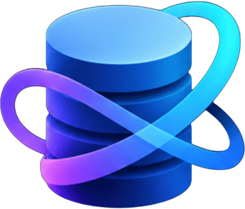
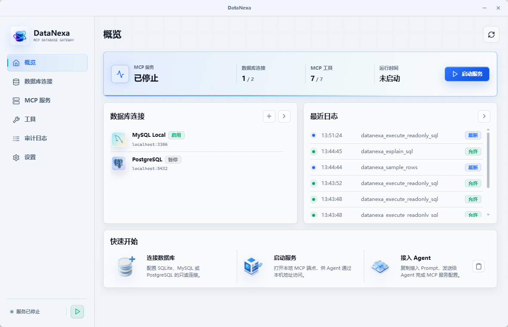

<p align="center">
  
</p>

<h1 align="center">DataNexa</h1>

<p align="center">
  <a href="../README.md">简体中文</a> | English
</p>

<p align="center">
  A local read-only database MCP gateway for AI agents
</p>

<p align="center">
  <a href="https://github.com/MingoZacwu/DataNexa/actions/workflows/compile.yml"></a>
  <a href="https://github.com/MingoZacwu/DataNexa/releases"></a>
  <a href="../LICENSE"></a>
</p>

DataNexa is a local database MCP service. It provides AI agents with a unified, controlled, and auditable data access gateway, applying read-only policies before queries are executed and enforcing limits on returned rows, execution time, and connection count.

DataNexa currently supports SQLite, MySQL, and PostgreSQL. Its desktop application is built with Tauri, React, and Rust.

## Features

- Manage read-only SQLite, MySQL, and PostgreSQL connections in one place
- Provide MCP tools for schema discovery, column descriptions, data sampling, read-only SQL, and query plans
- Validate queries against the SQL syntax tree and restrict them to read-only statements
- Support Bearer token authentication and manual token rotation
- Store database passwords in the operating system credential vault instead of regular configuration files
- Enforce limits on returned rows, query execution time, and connection pool size
- Keep local audit records with optional redaction of SQL literals
- Provide connection diagnostics, tool controls, emergency disable, and connection import/export
- Support Simplified Chinese and English interfaces, as well as light and dark themes

## Interface Preview



## Download and Installation

Prebuilt releases are available from the [Releases](https://github.com/MingoZacwu/DataNexa/releases) page. Choose the installer or executable for your operating system and use the latest stable version whenever possible.

After launching DataNexa for the first time, complete the setup in this order:

1. Create a database connection using a read-only database account.
2. Test the connection to confirm that the network, credentials, and permissions are configured correctly.
3. Start the local service from the "MCP Service" page.
4. Copy the agent connection configuration and add it to an MCP-compatible client.

## Build from Source

### Prerequisites

- [Git](https://git-scm.com/)
- [Node.js 20](https://nodejs.org/) or later
- [pnpm 9](https://pnpm.io/)
- [Rust stable](https://www.rust-lang.org/tools/install)
- System dependencies required by Tauri 2

System dependencies vary by platform. See [Tauri Prerequisites](https://v2.tauri.app/start/prerequisites/) for complete instructions:

- Windows: Microsoft C++ Build Tools, WebView2, and the Rust MSVC toolchain
- macOS: Xcode Command Line Tools
- Ubuntu/Debian: `libwebkit2gtk-4.1-dev`, `libayatana-appindicator3-dev`, `librsvg2-dev`, `patchelf`, and `xdg-utils`

### Get the Source Code

```bash
git clone https://github.com/MingoZacwu/DataNexa.git
cd DataNexa
corepack enable
corepack prepare pnpm@9 --activate
pnpm install --frozen-lockfile
```

### Local Development

```bash
pnpm run dev:app
```

This command starts the Vite development server and runs the application in a Tauri desktop window.

### Build the Executable

```bash
pnpm run build:portable
```

The build output is written to `src-tauri/target/release/`. On Windows, the executable is typically named `datanexa.exe`; on macOS and Linux, it is the platform-specific `datanexa` executable.

### Build an Installer

```bash
pnpm run build:installer
```

Installers and other platform-specific artifacts are written to:

```text
src-tauri/target/release/bundle/
```

To check only the frontend types and build output, run:

```bash
pnpm run build
```

> DataNexa can only produce a native application for the current build platform. To create Windows, macOS, and Linux versions, build separately on each corresponding operating system.

## Security

"Read-only" is a risk-reduction measure, not a guarantee of absolute security. Before connecting real data, we recommend taking the following precautions:

- Create a dedicated least-privilege database account for DataNexa and revoke write and administrative permissions at the database level
- Apply additional access controls to sensitive tables, sensitive fields, and production networks
- Keep Bearer token authentication enabled and do not disclose the token to untrusted applications
- Review audit records regularly and enable only the MCP tools required for the current task
- Maintain appropriate database backups and do not treat DataNexa as your only security boundary

Exported connection files contain database passwords in plaintext. Store exported files in an access-controlled location, delete them promptly after migration, and never commit them to a code repository or upload them to public storage.

If you discover a security issue, do not disclose database information, access credentials, or directly exploitable details in a public issue. Report it through a private contact method provided by the repository maintainer.

## Contributing

Issues and suggestions are welcome through [Issues](https://github.com/MingoZacwu/DataNexa/issues), as are pull requests. Before submitting code, make sure the frontend build, Rust formatting check, tests, and Clippy checks all pass:

```bash
pnpm run build
cargo fmt --manifest-path src-tauri/Cargo.toml -- --check
cargo test --manifest-path src-tauri/Cargo.toml --locked
cargo clippy --manifest-path src-tauri/Cargo.toml --all-targets --locked -- -D warnings
```

Before submitting an issue or log, remove connection strings, database names, account names, tokens, SQL literals, and business data.

## Disclaimer and Usage Notice

Data is invaluable. Use with caution.

The read-only policy cannot guarantee that every risk will be blocked. You must still actively constrain the agent and avoid asking or allowing it to perform dangerous database operations.

DataNexa is an open-source project independently developed and maintained by an individual. It is not affiliated with or officially endorsed by MySQL, PostgreSQL, SQLite, MCP clients, or their respective organizations.

This project is provided "as is," without any express or implied warranty of fitness, reliability, security, or data integrity. To the fullest extent permitted by applicable law, the project author and contributors are not liable for data loss, service interruption, security incidents, or other damages arising from the use of or inability to use this project. Users are responsible for evaluating risks and for database permissions, backups, network isolation, and compliance requirements.

## License

This project is open source under the [MIT License](../LICENSE). You may use, copy, modify, merge, publish, and distribute the project as permitted by the license, provided that you retain the original copyright notice and license text.

## Copyright

Copyright (C) 2026 Zachary Wu

MySQL, PostgreSQL, SQLite, and all other names and trademarks belong to their respective owners.
